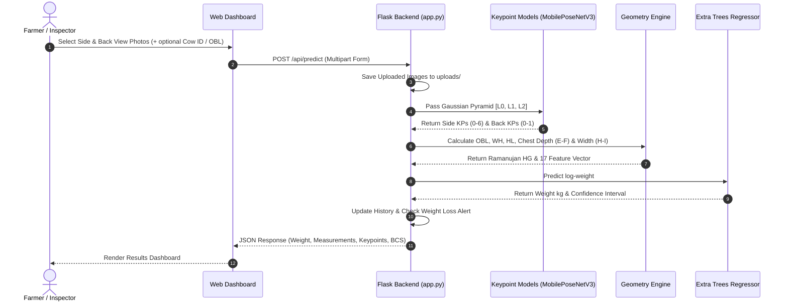

# System Architecture

## System Overview
The system is built on a modular computer vision and machine learning pipeline that performs non-contact cattle weight and biometric measurement estimation using standard side-view and back-view images. It incorporates multi-scale Gaussian pyramid feature extraction, PyTorch keypoint regression, Ramanujan ellipse geometry modeling, and Extra Trees ensemble regression.

## Architecture Diagram

```mermaid
graph TB
    subgraph Client Layer
        UI["🌐 WebApp (index.html / JS Dashboard)"]
    end

    subgraph Service Layer (Flask API)
        App["🐍 app.py (Flask REST Server)"]
        PredictRoute["/api/predict"]
        StatusRoute["/api/status"]
        HistoryRoute["/api/history"]
        DB["💾 cattle_database.json"]
    end

    subgraph Machine Learning Pipeline
        Pyramid["📐 get_pyramid() (3-Level Gaussian Pyramid)"]
        PoseNetSide["🧠 MobilePoseNetV3 (Side View 7-KP)"]
        PoseNetBack["🧠 MobilePoseNetV3 (Back View 2-KP)"]
        Geometry["📏 Geometry Engine (Ramanujan HG & Ratios)"]
        ETRegressor["🌲 ExtraTreesRegressor (17-Feature Log-Y)"]
    end

    UI -->|POST Form Data & Images| PredictRoute
    PredictRoute --> App
    App --> Pyramid
    Pyramid --> PoseNetSide
    Pyramid --> PoseNetBack
    PoseNetSide --> Geometry
    PoseNetBack --> Geometry
    Geometry --> ETRegressor
    ETRegressor --> App
    App --> DB
    App -->|JSON Response| UI
```

## Component Descriptions

### `Flask Application Server (app.py)`
- **Purpose**: Serves REST endpoints, handles file uploads, performs database operations, and orchestrates machine learning models.
- **Responsibilities**: Request routing, input validation, image preprocessing, history tracking, and response formatting.
- **Dependencies**: `Flask`, `PyTorch`, `OpenCV`, `scikit-learn`, `numpy`.
- **Type**: Application / API Backend.

### `MobilePoseNetV3 (models/keypoint_model/law_model.py)`
- **Purpose**: Lightweight multi-scale keypoint detection network.
- **Responsibilities**: Processes 3-level Gaussian Pyramids ($224 \times 224$) and outputs keypoint coordinate matrices for side view (7 keypoints) and back view (2 keypoints).
- **Dependencies**: `torch`, `torchvision.models.mobilenet_v3_small`.
- **Type**: Deep Learning Model.

### `Geometry & Measurement Engine`
- **Purpose**: Translates pixel coordinates into real-world body measurements and Ramanujan Heart Girth (HG).
- **Responsibilities**: Calculates Euclidean pixel distances, applies calibration ratio ($OBL / \text{pixel\_OBL}$), derives chest depth ($E \rightarrow F$), chest width ($H \rightarrow I$), and evaluates Ramanujan's ellipse perimeter formula.
- **Dependencies**: `numpy`.
- **Type**: Core Algorithmic Utility.

### `ExtraTrees Weight Regressor`
- **Purpose**: Estimates final body weight in kg.
- **Responsibilities**: Receives 17 volumetric features and predicts log-weight $\ln W$, transformed to $W = \exp(\hat{y})$.
- **Dependencies**: `scikit-learn`.
- **Type**: Machine Learning Model.

## Data Flow



## Integration Points
- **REST APIs**: `GET /api/status`, `POST /api/predict`, `GET /api/history`, `POST /api/clear`.
- **Databases**: Local JSON storage (`data/cattle_database.json`).
- **External 3D Reconstruction Server (Optional)**: Integration hook to `http://localhost:9090/reconstruct` for multi-view 3D mesh GLB generation.
