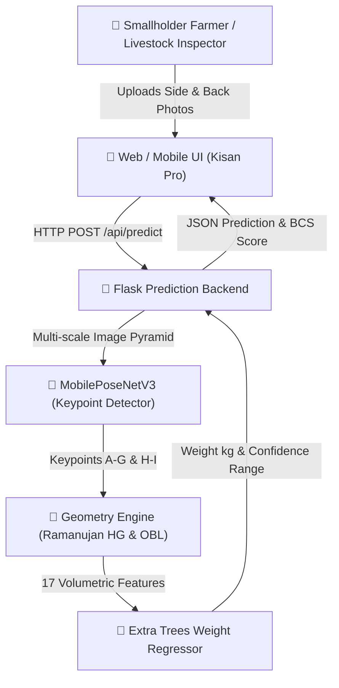

# Business Overview

## Business Context Diagram

## Business Description
- **Business Description**: The **Non-Contact Cattle Weight & Keypoint Estimation System** provides a low-cost, stress-free, and rapid solution for farmers and livestock managers to measure cattle body weight, body dimensions (Oblique Body Length, Withers Height, Heart Girth, Hip Length), and Body Condition Score (BCS) directly from ordinary smartphone photos (Side View & Back View).
- **Business Transactions**:
  1. **Non-Contact Weight Estimation Transaction**: User uploads side and back view photos; system detects keypoints, computes Ramanujan Heart Girth, and returns weight in kilograms with confidence interval ($\pm 5\%$).
  2. **Automated Biometric Measurement Transaction**: Extracts Oblique Body Length (OBL), Withers Height (WH), Heart Girth (HG), and Hip Length (HL) in centimeters.
  3. **Multi-Section Breed Routing Transaction**: Selects formula routes: Extra Trees 17-feature model for Dairy/Beef cattle, Schaeffer's Formula (constant 10815) for Calves, and Agarwal's Formula for Draft/Buffalo.
  4. **Dual-Domain Body Condition Scoring (BCS) Transaction**: Calculates 1–9 US Body Condition Score based on heart girth-to-height ratio.
  5. **Cattle Weight Loss Alert Transaction**: Monitors historical cattle measurements and issues alert warnings if consecutive weight loss is detected across 3+ readings.
- **Business Dictionary**:
  - **OBL (Oblique Body Length)**: Straight-line distance from shoulder joint to pin bone (ischial tuberosity).
  - **WH (Withers Height)**: Vertical height from ground plane to highest point of withers.
  - **HG (Heart Girth)**: Elliptical cross-section circumference behind forelegs calculated via Ramanujan's formula.
  - **HL (Hip Length)**: Distance from iliac bone to ischial tuberosity.
  - **Points E & F**: Side view chest top and chest bottom keypoints defining chest vertical depth ($2a$).
  - **Points H & I**: Back view chest left and right keypoints defining chest horizontal width ($2b$).
  - **LaWE**: Lightweight Network-based Cattle Weight Estimation model.

## Component Level Business Descriptions
### `MobilePoseNetV3` (Keypoint Generation Component)
- **Purpose**: Automatically identifies key anatomical landmarks on cattle from side and back view photos using a 3-level Gaussian Image Pyramid ($L_0, L_1, L_2$) fused with a MobileNetV3-Small backbone.
- **Responsibilities**: Predicts 7 keypoints on side view and 2 keypoints on back view with high spatial precision.

### `ExtraTreesRegressor` (Weight Prediction Engine)
- **Purpose**: Computes log-transformed cattle body weight ($\ln W$) using 17 volumetric, ratio, and log-transformed features derived from keypoint measurements.
- **Responsibilities**: Outputs high-accuracy weight estimation ($R^2 > 0.88$, $\text{MAPE} < 3.7\%$).

### `Flask Web API & Kisan UI` (User Interface Component)
- **Purpose**: Serves interactive web dashboard for uploading images, viewing keypoints, and reviewing weight history & alerts.
- **Responsibilities**: Handles image upload, persistent database updates (`cattle_database.json`), and REST API endpoints.
