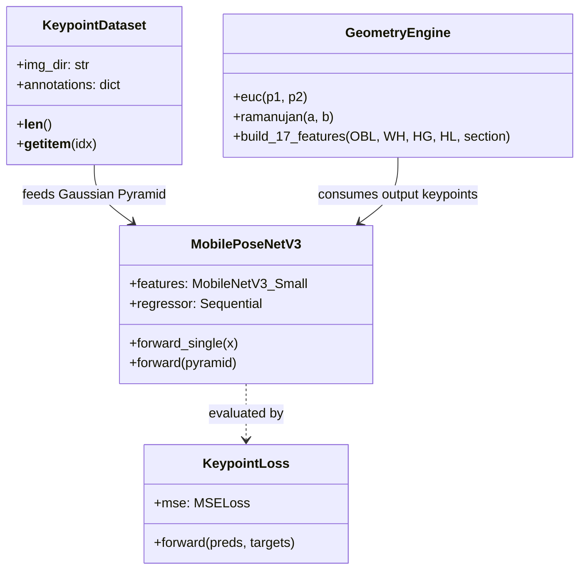

# Code Structure

## Build System
- **Type**: Python 3.11 Package & Script Environment.
- **Configuration**: `requirements.txt`, standard `sys.path` project root imports.

## Key Classes & Modules

## Existing Files Inventory

- `F:\Cattle Keypoints detection Training Code\train_keypoints.py`: Training entrypoint for `MobilePoseNetV3` models over side and back view datasets.
- `F:\Cattle Keypoints detection Training Code\annotations_generator.py`: Ground truth annotation generator executing pre-trained keypoint detector across raw dataset images.
- `F:\Cattle Keypoints detection Training Code\draw_keypoint_visualizations.py`: Visualizer overlaying detected keypoints (Points E, F, H, I) and anatomical lines on cattle images.
- `F:\Cattle Keypoints detection Training Code\dataset.py`: PyTorch `KeypointDataset` class implementing 3-level Gaussian Pyramid downsampling ($L_0, L_1, L_2$) and data augmentation.
- `F:\Cattle Keypoints detection Training Code\models\keypoint_model\law_model.py`: PyTorch implementation of `MobilePoseNetV3` (LaWE Model).
- `F:\Cattle Keypoints detection Training Code\models\keypoint_model\loss.py`: PyTorch `KeypointLoss` MSE regression module.
- `F:\Cattle Keypoints detection Training Code\models\kp_weights\kp_side_best.pth`: Saved PyTorch model weights for 7-keypoint side view detector.
- `F:\Cattle Keypoints detection Training Code\models\kp_weights\kp_back_best.pth`: Saved PyTorch model weights for 2-keypoint back view detector.
- `F:\Cattle Keypoints detection Training Code\models\cattle_weight_v2_super_production_model.pkl`: Serialized `ExtraTreesRegressor` weight estimation model.

## Design Patterns

### 1. Multi-Scale Feature Fusion (Gaussian Pyramid Pattern)
- **Location**: `dataset.py` & `models/keypoint_model/law_model.py`.
- **Purpose**: Captures keypoint features at multiple receptive field resolutions without introducing excessive parameter count.
- **Implementation**: Downsamples images into $L_0, L_1, L_2$ levels via `cv2.pyrDown` and combines predictions using weighted sum ($0.4 \cdot L_0 + 0.4 \cdot L_1 + 0.2 \cdot L_2$).

### 2. Strategy / Route Pattern
- **Location**: `predict_weight` in `app.py`.
- **Purpose**: Chooses mathematical weight estimation method based on cattle section/category.
- **Implementation**: Routes to Schaeffer's formula for Calves, Agarwal's formula for Draft/Buffalo, and Extra Trees Regressor for Dairy/Beef adults.

## Critical Dependencies

### `torch` & `torchvision`
- **Version**: `2.x+` (CUDA-enabled).
- **Usage**: Deep learning backbone, tensor operations, model parameter serialization (`.pth`).

### `scikit-learn`
- **Version**: `1.x+`.
- **Usage**: `ExtraTreesRegressor` prediction and feature evaluation.

### `opencv-python` (`cv2`)
- **Version**: `4.x+`.
- **Usage**: Image loading, Gaussian Pyramid creation (`pyrDown`), color conversion, and keypoint visualization rendering.
