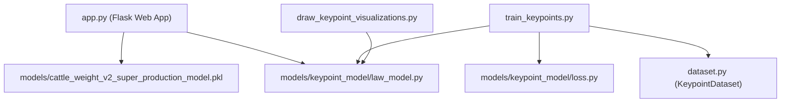

# Dependencies

## Internal Dependencies

### `app.py` depends on `law_model.py`
- **Type**: Runtime / Import.
- **Reason**: Loads `MobilePoseNetV3` keypoint detector architecture to evaluate uploaded photos.

### `train_keypoints.py` depends on `dataset.py` & `loss.py`
- **Type**: Compile / Runtime.
- **Reason**: Fetches multi-scale Gaussian Pyramids from dataset and computes MSE loss over keypoints.

---

## External Dependencies

### `torch` & `torchvision`
- **Version**: `>= 2.0.0`
- **Purpose**: Deep learning framework for `MobilePoseNetV3`.
- **License**: BSD.

### `opencv-python`
- **Version**: `>= 4.8.0`
- **Purpose**: Computer vision, pyramid generation (`cv2.pyrDown`), image I/O, and keypoint visualizer rendering.
- **License**: Apache 2.0.

### `scikit-learn`
- **Version**: `>= 1.3.0`
- **Purpose**: `ExtraTreesRegressor` ensemble model execution.
- **License**: BSD.

### `flask`
- **Version**: `>= 3.0.0`
- **Purpose**: REST API backend server.
- **License**: BSD.
