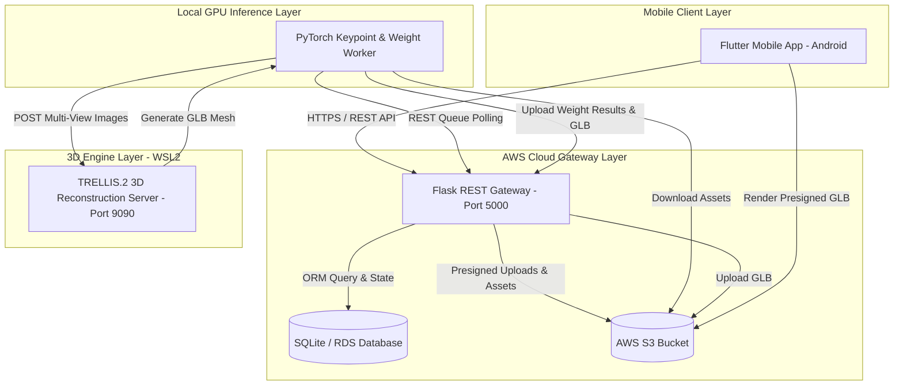
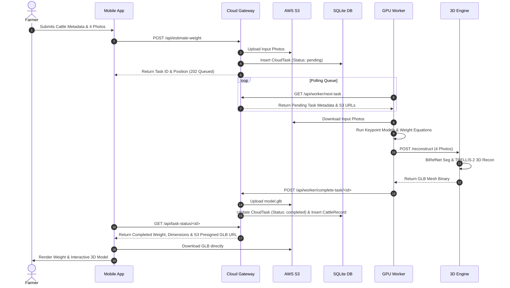

# System Architecture

## System Overview
The Cattle Weight Monitoring System follows a distributed, multi-tier clean architecture designed to decouple mobile client interactions, cloud API management, GPU-accelerated computer vision, and high-memory 3D mesh reconstruction.

## Architecture Diagram

## Component Descriptions

### `cattle_weight_app`
- **Purpose**: Mobile client app built in Flutter.
- **Responsibilities**: Form input, photo capture, JWT auth, history listing, model validation UI, health alert logic.
- **Dependencies**: `http`, `model_viewer_plus`, `shared_preferences`, `share_plus`, `pdf`.
- **Type**: Application (Mobile Client).

### `cloud_gateway`
- **Purpose**: Cloud API & Database gateway built in Python Flask + Gunicorn.
- **Responsibilities**: User authentication, job dispatching, S3 object management, database migrations.
- **Dependencies**: `Flask`, `Flask-SQLAlchemy`, `Flask-JWT-Extended`, `boto3`, `gunicorn`.
- **Type**: Application (Cloud Gateway).

### `local_pc_worker`
- **Purpose**: PyTorch GPU worker script.
- **Responsibilities**: Keypoint inference, Ramanujan girth math, Schaeffer/Agarwal/ExtraTrees models, 3D server bridge.
- **Dependencies**: `torch`, `torchvision`, `opencv-python`, `scikit-learn`, `requests`.
- **Type**: Application (GPU Worker).

### `wsl_3d_server`
- **Purpose**: WSL2 Linux Flask 3D server.
- **Responsibilities**: BiRefNet background segmentation, TRELLIS.2 3D mesh reconstruction, GLB export.
- **Dependencies**: `torch`, `trellis2`, `trimesh`, `Flask`, `BiRefNet`.
- **Type**: Application (3D Engine).

## Data Flow

## Integration Points
- **External APIs**: AWS S3 Presigned URL API (for direct asset downloads).
- **Databases**: SQLite database (`cattle_app.db`) managed via Flask-SQLAlchemy.
- **Third-Party Services**: AWS S3 (`kisanpro-cattle-weight-data` bucket).

## Infrastructure Components
- **Server Deployment**: AWS EC2 Instance (`35.153.224.84`), Ubuntu/Amazon Linux, Gunicorn (Port 5000).
- **Local Compute**: Windows 11 PC (NVIDIA CUDA GPU) + WSL2 Linux (Port 9090).
- **Networking**: Inbound TCP Port 5000 open in AWS Security Group.
