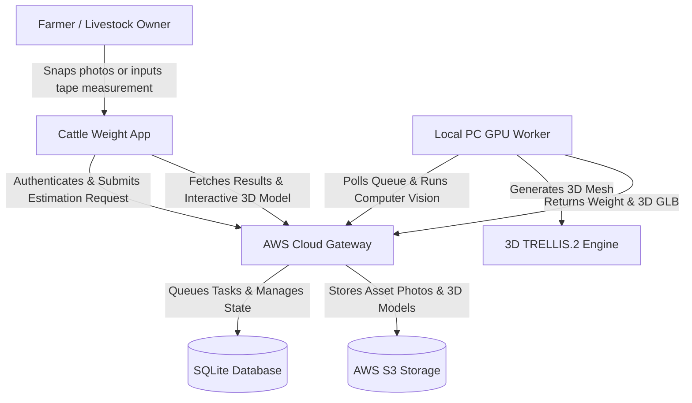

# Business Overview

## Business Context Diagram

## Business Description
- **Business Description**: The Cattle Weight Monitoring System is an AI-powered, non-contact livestock biometric and weight estimation platform designed for farmers, dairy producers, and veterinary professionals. The platform allows users to estimate cattle weight without physical scale infrastructure using deep learning keypoint detection, veterinary anthropometric formulas (Ramanujan ellipse perimeter, Schaeffer, and Agarwal), and TRELLIS.2 3D mesh reconstruction.
- **Business Transactions**:
  - **User Registration & Authentication**: Secure onboarding and JWT login for farmers and farm managers.
  - **Manual Tape Weight Estimation**: Instant estimation using tape-measured heart girth, length, and height inputs.
  - **AI Image-Based Weight Estimation**: Automated estimation using 4 multi-view cattle photos (Side Left, Side Right, Back, Front).
  - **3D Mesh Generation & Render**: Interactive 3D visual reconstruction of cattle body condition.
  - **Herd Health Alerts**: Automatic tracking of weight gain/loss trends across consecutive readings to detect illness or nutritional deficiencies.
  - **History & CSV Export**: Historical tracking of cattle growth and herd weight distribution with native share sheet export.
  - **Custom Breed Request**: Tracking requested livestock breeds not yet explicitly calibrated in the AI database.

## Business Dictionary
- **OBL (One-Side Body Length)**: Distance from humerus head (shoulder) to pin bone.
- **WH (Withers Height)**: Vertical height from ground to wither peak.
- **HG (Heart Girth)**: Perimeter of the chest cross-section directly behind the front legs.
- **HL (Hip Length)**: Width across the hip bones viewed from the back.
- **Schaeffer Formula**: Metric-adapted veterinary formula for calves ($\le 95\text{ cm } OBL$): $\text{Weight (kg)} = \frac{OBL \times HG^2}{10815}$.
- **Agarwal Formula**: Veterinary formula for Indian draft breeds (Hallikar, Deoni, Ongole).
- **ExtraTrees Regressor**: Biometric machine learning model trained on 17 anatomical ratios for dairy and beef cattle.

---

## Component Level Business Descriptions

### `cattle_weight_app` (Mobile Client)
- **Purpose**: Provides farmers with an intuitive mobile UI for recording cattle measurements, capturing multi-view photos, viewing 3D models, tracking herd health, and reviewing history.
- **Responsibilities**:
  - User authentication and state management.
  - Image capture and local preprocessing.
  - Interactive 3D model rendering via `<model-viewer>`.
  - CSV history exporting and health alert threshold calculations.

### `cloud_gateway` (AWS EC2 Backend Service)
- **Purpose**: Central cloud REST API gateway and job broker.
- **Responsibilities**:
  - User identity management and JWT verification.
  - Asynchronous task queueing and state tracking (`CloudTask`).
  - AWS S3 bucket object management for images and `.glb` files.
  - Serving Model Validation benchmarks and historical records.

### `local_pc_worker` (GPU Inference Engine)
- **Purpose**: High-performance PyTorch worker handling computer vision and ML weight math.
- **Responsibilities**:
  - Polling tasks from cloud gateway.
  - Biometric keypoint detection via `MobilePoseNetV3`.
  - Decoupled physical vs scaled measurement calculations.
  - Multi-model weight estimation execution.
  - Invoking 3D mesh reconstruction pipeline.

### `wsl_3d_server` (3D Mesh Reconstruction Engine)
- **Purpose**: Generates interactive 3D `.glb` models from multi-view photos.
- **Responsibilities**:
  - Background removal via BiRefNet.
  - 3D mesh geometry and texture generation via TRELLIS.2.
  - Auto-restarting memory management to maintain VRAM health.
