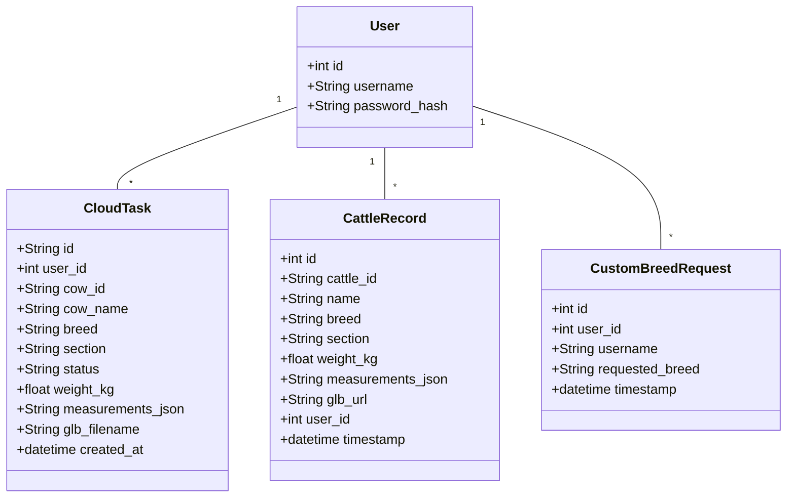

# Code Structure

## Build System
- **Type**: Flutter / Dart (Mobile Client), Python / pip / venv (Cloud & Worker Services), Bash Shell Scripts (WSL Engine).
- **Configuration**:
  - Mobile App: `pubspec.yaml`
  - Cloud Gateway: `requirements_cloud.txt`
  - GPU Worker: `requirements_worker.txt`

## Key Classes/Modules

### Existing Files Inventory

- `cloud_gateway/app_cloud.py` - Flask REST API gateway, JWT auth, database controller, and S3 presigned URL generator.
- `cloud_gateway/database.py` - SQLAlchemy models definition (`User`, `CloudTask`, `CattleRecord`, `CustomBreedRequest`).
- `local_pc_worker/gpu_worker.py` - PyTorch worker script performing keypoint detection, dimension calibration, weight prediction, and 3D server bridge.
- `wsl_3d_server/app.py` - Flask 3D server entry point listening on Port 9090 in WSL2.
- `wsl_3d_server/inference.py` - TRELLIS.2 pipeline initializer and BiRefNet background segmentation engine wrapper.
- `wsl_3d_server/run_forever.sh` - Auto-restart daemon loop script for memory recycling.
- `cattle_weight_app/lib/main.dart` - Entry point for Flutter application.
- `cattle_weight_app/lib/screens/login_screen.dart` - UI screen for login and registration.
- `cattle_weight_app/lib/screens/home_screen.dart` - Main dashboard UI for manual and image estimation modes.
- `cattle_weight_app/lib/screens/result_screen.dart` - Result visualization UI with interactive 3D model canvas.
- `cattle_weight_app/lib/screens/history_screen.dart` - Historical logs UI with CSV export.
- `cattle_weight_app/lib/screens/alerts_screen.dart` - Herd health alert monitoring screen.
- `cattle_weight_app/lib/screens/validation_screen.dart` - Model validation UI comparing Tape vs AI predictions.
- `cattle_weight_app/lib/services/api_service.dart` - Flutter API client handling HTTP calls and JWT storage.

## Design Patterns

### 1. Decoupled Dimension Pattern
- **Location**: `local_pc_worker/gpu_worker.py`
- **Purpose**: Separates physical measurements (used for UI display and veterinary equations) from scaled measurements (used for ExtraTrees ML model feature vector).
- **Implementation**: Computes `HG_physical` using Ramanujan perimeter and `HG_scaled` by applying breed depth/width scaling multipliers (`0.7850`, `0.8800`).

### 2. Provider / Repository Service Pattern
- **Location**: `cattle_weight_app/lib/services/api_service.dart`
- **Purpose**: Encapsulates network operations, authentication headers, error handling, and `SharedPreferences` token management.

### 3. Asynchronous Worker / Queue Pattern
- **Location**: `cloud_gateway/app_cloud.py` & `local_pc_worker/gpu_worker.py`
- **Purpose**: Prevents long-running heavy AI computation from blocking HTTP client requests.

---

## Critical Dependencies

### 1. PyTorch (`torch`, `torchvision`)
- **Version**: `2.x+cuda`
- **Usage**: Deep learning keypoint detection and TRELLIS.2 3D mesh reconstruction.

### 2. Flask & Gunicorn
- **Version**: Flask `3.x`, Gunicorn `21.x`
- **Usage**: REST API server hosting on AWS EC2.

### 3. ModelViewer Plus (`model_viewer_plus`)
- **Version**: `^1.8.0`
- **Usage**: Flutter WebGL container rendering interactive 3D `.glb` meshes.

### 4. Boto3 (`boto3`)
- **Version**: `^1.34.0`
- **Usage**: AWS S3 SDK for file uploads and presigned URL generation.
