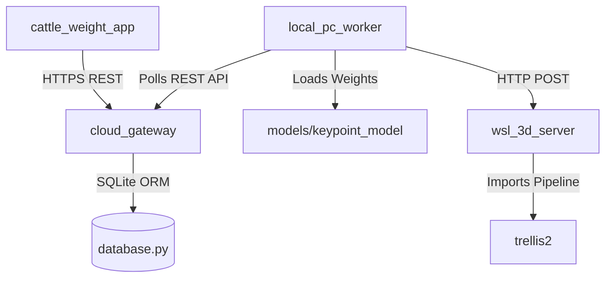

# Dependencies

## Internal Dependencies

### `cattle_weight_app` depends on `cloud_gateway`
- **Type**: Runtime API Integration.
- **Reason**: Authenticates users, submits estimation jobs, fetches status, and loads history.

### `local_pc_worker` depends on `cloud_gateway` & `wsl_3d_server`
- **Type**: Asynchronous Worker Broker.
- **Reason**: Fetches tasks from gateway, runs keypoints locally, and requests 3D GLB reconstruction from WSL server.

### `wsl_3d_server` depends on `trellis2`
- **Type**: Model Dependency.
- **Reason**: Imports `Trellis2ImageTo3DPipeline` to execute flow matching transformer for 3D mesh creation.

---

## External Dependencies

### 1. `model_viewer_plus` (Flutter)
- **Version**: `^1.8.0`
- **Purpose**: Embeds Google `<model-viewer>` WebGL canvas inside Android views.
- **License**: Apache-2.0

### 2. `boto3` (Python)
- **Version**: `^1.34.0`
- **Purpose**: AWS SDK for Python to generate pre-signed S3 URLs and manage cloud storage.
- **License**: Apache-2.0

### 3. `Flask-JWT-Extended` (Python)
- **Version**: `^4.6.0`
- **Purpose**: Secure JSON Web Token authentication and route protection.
- **License**: MIT

### 4. `BiRefNet` (PyTorch)
- **Version**: `latest`
- **Purpose**: High-resolution background segmentation to isolate cattle from farm backgrounds.
- **License**: MIT
